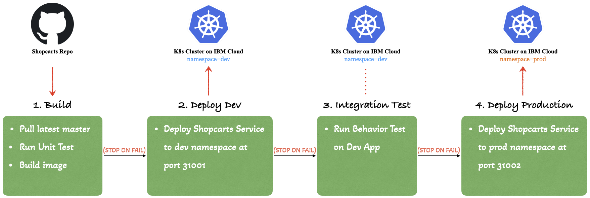

# Shopcarts Service

[](https://github.com/CSCI-GA-2820-SU23-001/shopcarts/actions)
[](https://codecov.io/gh/CSCI-GA-2820-SU23-001/shopcarts)
[](https://opensource.org/licenses/Apache-2.0)
[](https://python.org/)

## Contents
* [Sites](#sites)
  * [Production](http://159.122.175.64:31002)
    * [/shopcartsapi](http://159.122.175.64:31002/shopcartsapi)
    * [/itemsapi](http://159.122.175.64:31002/itemsapi)
  * [Development](http://159.122.175.64:31001)
* [CI/CD Workflow](#cicd-workflow)
* [Documentation](#documentation)
  * [List of RESTful Routes](#list-of-restful-routes)
  * [Swagger Doc](http://159.122.175.64:31002/apidocs)


## Sites
* [Production](http://159.122.175.64:31002)
* [Development](http://159.122.175.64:31001)


## CI/CD Workflow



## Documentation

This project leverages [Flask-RESTX](https://flask-restx.readthedocs.io/en/latest/) to generate [Swagger/OpenAPI](https://www.openapis.org/) documentation available at [/apidocs](http://159.122.175.64:31002/apidocs).

### List of RESTful Routes

These are the RESTful routes for `shopcarts` and `items`:

```markdown
Endpoint          Methods  Rule
----------------  -------  -----------------------------------------------------
index             GET      /

health            GET      /health

list_shopcarts    GET      /shopcarts
create_shopcarts  POST     /shopcarts
get_shopcarts     GET      /shopcarts/<shopcart_id>
update_shopcarts  PUT      /shopcarts/<shopcart_id>
delete_shopcarts  DELETE   /shopcarts/<shopcart_id>
clear_shopcarts   PUT      /shopcarts/<shopcart_id>/clear

list_items        GET      /shopcarts/<shopcart_id>/items
create_items      POST     /shopcarts/<shopcart_id>/items
get_items         GET      /shopcarts/<shopcart_id>/items/<item_id>
update_items      PUT      /shopcarts/<shopcart_id>/items/<item_id>
delete_items      DELETE   /shopcarts/<shopcart_id>/items/<item_id>
```

The test cases can be run with `green`.


#### Health Check
Get service health status.

##### API Endpoint
GET /health

##### Request Headers
| Header       | Value            |
|--------------|------------------|
| Content-Type | application/json |

##### Response
###### 200 OK
```json
{
  "status": "OK"
}
```


## Database Connection

### Steps

1. Leveraging the Docker command to launch the PostgreSQL CLI in the shopcarts.db container using the following command:

    ```bash
    docker exec -it shopcarts.db psql -U postgres -d postgres -h localhost -p 5432
    ```

## License

Copyright (c) John Rofrano. All rights reserved.

Licensed under the Apache License. See [LICENSE](LICENSE)

This repository is part of the NYU masters class: **CSCI-GA.2820-001 DevOps and Agile Methodologies** created and taught by *John Rofrano*, Adjunct Instructor, NYU Courant Institute, Graduate Division, Computer Science, and NYU Stern School of Business.
